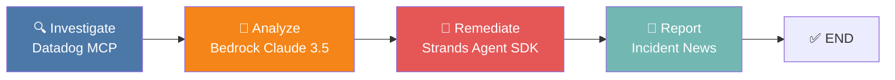

# 🚨 SRE AI Agent

**An AI-powered Site Reliability Engineering agent** that investigates production errors, analyzes root causes, executes remediation, and generates journalistic incident reports — all orchestrated by a LangGraph state machine and fully traced by Datadog LLM Observability.

---

## Architecture



| Step | Component | Technology |
|------|-----------|------------|
| Investigate | Datadog MCP Client | `httpx` → Datadog REST API |
| Analyze | Root Cause Analysis | `boto3` → Amazon Bedrock (Claude 3.5 Sonnet) |
| Remediate | Automated Fix Execution | `strands-agents` SDK with Lambda/Cache/ECS tools |
| Report | Incident News Report | Bedrock Claude (creative mode) |

---

## Quick Start

### 1. Install Dependencies

```bash
pip install -r requirements.txt
```

### 2. Configure Environment

```bash
cp .env.example .env
# Edit .env with your credentials
```

### 3. Run the Server

```bash
python server.py
```

### 4. Send an Investigation Request

```bash
# Synchronous (full result)
curl -X POST http://localhost:8000/api/investigate \
  -H "Content-Type: application/json" \
  -d '{"service_name": "UserAuth", "error_type": "500"}'

# Streaming (SSE for React frontend)
curl -N http://localhost:8000/api/investigate/stream \
  -X POST \
  -H "Content-Type: application/json" \
  -d '{"service_name": "UserAuth", "error_type": "500"}'
```

---

## Project Structure

```
sre-ai-agent/
├── agent.py              # LangGraph state machine (4 nodes)
├── server.py             # FastAPI + SSE streaming + LLMObs init
├── config.py             # Pydantic Settings (.env loader)
├── state.py              # TypedDict state definitions
├── reporting.py           # Incident report generator
├── tools/
│   ├── datadog_mcp.py     # Datadog REST API queries
│   ├── bedrock_llm.py     # Bedrock Claude integration
│   └── strands_remediation.py  # Strands Agent + AWS tools
├── requirements.txt
├── .env.example
└── README.md
```

---

## React Frontend Integration

The `/api/investigate/stream` endpoint uses **Server-Sent Events (SSE)**. Connect from React:

```jsx
const startInvestigation = (serviceName, errorType) => {
  const response = await fetch('/api/investigate/stream', {
    method: 'POST',
    headers: { 'Content-Type': 'application/json' },
    body: JSON.stringify({ service_name: serviceName, error_type: errorType }),
  });

  const reader = response.body.getReader();
  const decoder = new TextDecoder();

  while (true) {
    const { done, value } = await reader.read();
    if (done) break;

    const lines = decoder.decode(value).split('\n');
    for (const line of lines) {
      if (line.startsWith('data: ')) {
        const msg = JSON.parse(line.slice(6));
        // msg = { step: "investigate", type: "thought", content: "🔍 ..." }
        updateUI(msg);
      }
    }
  }
};
```

Each SSE message has this shape:

```json
{
  "step": "investigate | analyze | remediate | report",
  "type": "thought | result | progress | error",
  "content": "Human-readable description of what the agent is doing"
}
```

---

## 📊 Datadog LLM Observability — How It Works

This project uses the **`ddtrace` library** to provide full observability into the AI agent's behavior, latency, and cost. Here's exactly how each piece works:

### 1. Initialization — `LLMObs.enable()`

In `server.py`, the Datadog LLM Observability SDK is initialized on application startup:

```python
LLMObs.enable(
    ml_app="sre-ai-agent",       # Groups all traces under this app name
    api_key=cfg.dd_api_key,      # Your Datadog API key
    site=cfg.dd_site,            # e.g. "datadoghq.com"
    env=cfg.dd_env,              # Environment tag (production, staging)
    service=cfg.dd_service,      # Service name in APM
    agentless_enabled=True,      # Send traces directly (no dd-agent sidecar needed)
)
```

**What this does:**
- Establishes a connection to Datadog's trace intake
- Configures automatic span collection for LLM calls
- Tags all traces with service/env metadata for filtering

### 2. Decorator-Based Tracing

Three decorators are used throughout the codebase, each creating a different **span type** in Datadog:

| Decorator | Used In | What It Captures |
|-----------|---------|------------------|
| `@LLMObs.workflow()` | `datadog_mcp.py`, `agent.py`, `reporting.py` | End-to-end latency, input/output, error status |
| `@LLMObs.llm()` | `bedrock_llm.py` | **Prompt text**, **completion text**, **token usage** (input/output), model name, latency |
| `@LLMObs.task()` | `strands_remediation.py` | Task-level spans for remediation actions |

#### Example: `@llm` on Bedrock Calls

```python
@llm(model_name="claude-3.5-sonnet", model_provider="aws_bedrock")
def analyze_root_cause(investigation_data: dict) -> str:
    ...
```

This automatically captures:
- 📝 **Prompt & Completion** — the exact text sent to and received from Claude
- 🔢 **Token Usage** — `input_tokens` and `output_tokens` from the Bedrock response
- ⏱️ **Latency** — wall-clock time for the API call
- ❌ **Errors** — any exceptions are tagged on the span

#### Example: `@workflow` on Pipeline Nodes

```python
@workflow(name="node.investigate")
async def investigate_node(state: SREAgentState) -> SREAgentState:
    ...
```

This creates a parent span that encompasses all child operations (Datadog queries, etc.), giving you a **full trace waterfall** in the Datadog APM UI.

### 3. What You See in Datadog

After running the agent, navigate to **Datadog → LLM Observability** to see:

| Dashboard Section | Data Shown |
|-------------------|------------|
| **Traces** | Full waterfall: `sre_agent.run` → `investigate` → `analyze` → `remediate` → `report` |
| **LLM Calls** | Each Claude invocation with prompt, completion, and token counts |
| **Latency** | Per-node and per-LLM-call latency breakdown |
| **Token Usage** | Total input/output tokens per run, enabling cost tracking |
| **Error Rate** | Failed nodes or LLM calls highlighted in red |
| **Span Tags** | `service:sre-ai-agent`, `env:production`, `ml_app:sre-ai-agent` |

### 4. Shutdown

On server shutdown, `LLMObs.flush()` is called to ensure all buffered traces are sent to Datadog before the process exits.

---

## Environment Variables

| Variable | Required | Default | Description |
|----------|----------|---------|-------------|
| `DD_API_KEY` | ✅ | — | Datadog API key |
| `DD_APP_KEY` | ✅ | — | Datadog Application key |
| `DD_SITE` | ❌ | `datadoghq.com` | Datadog site |
| `DD_SERVICE` | ❌ | `sre-ai-agent` | Service name for traces |
| `DD_ENV` | ❌ | `production` | Environment tag |
| `AWS_REGION` | ❌ | `us-east-1` | AWS region for Bedrock |
| `AWS_ACCESS_KEY_ID` | ⚠️ | — | Required unless using IAM roles |
| `AWS_SECRET_ACCESS_KEY` | ⚠️ | — | Required unless using IAM roles |
| `BEDROCK_MODEL_ID` | ❌ | `anthropic.claude-3-5-sonnet-20241022-v2:0` | Bedrock model |
| `STRANDS_API_KEY` | ⚠️ | — | Strands Agents key |
| `SERVER_HOST` | ❌ | `0.0.0.0` | Server bind host |
| `SERVER_PORT` | ❌ | `8000` | Server bind port |

---

## License

MIT
